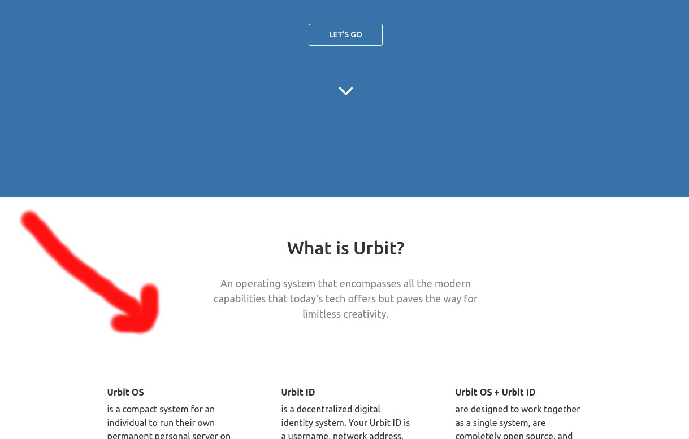
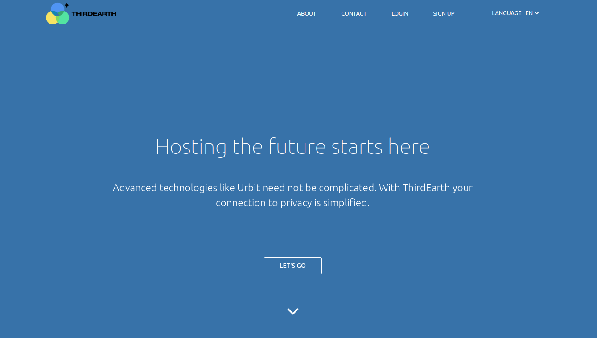
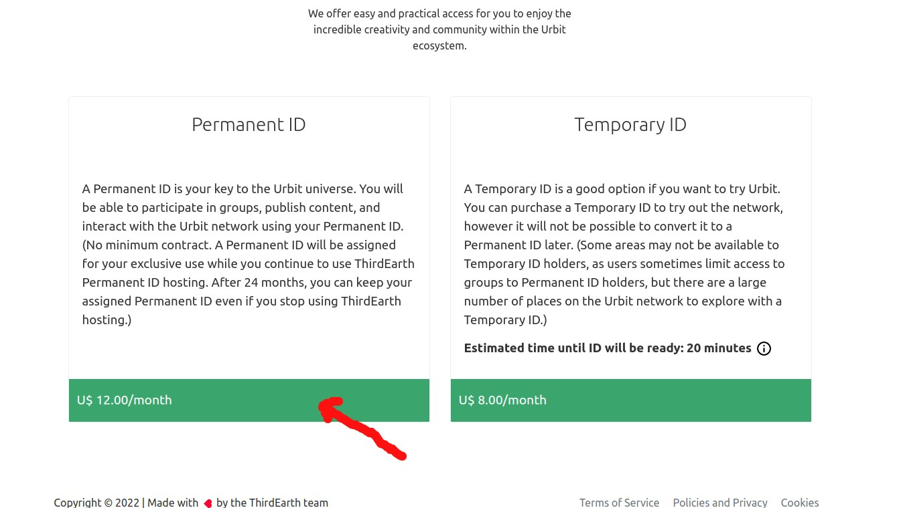
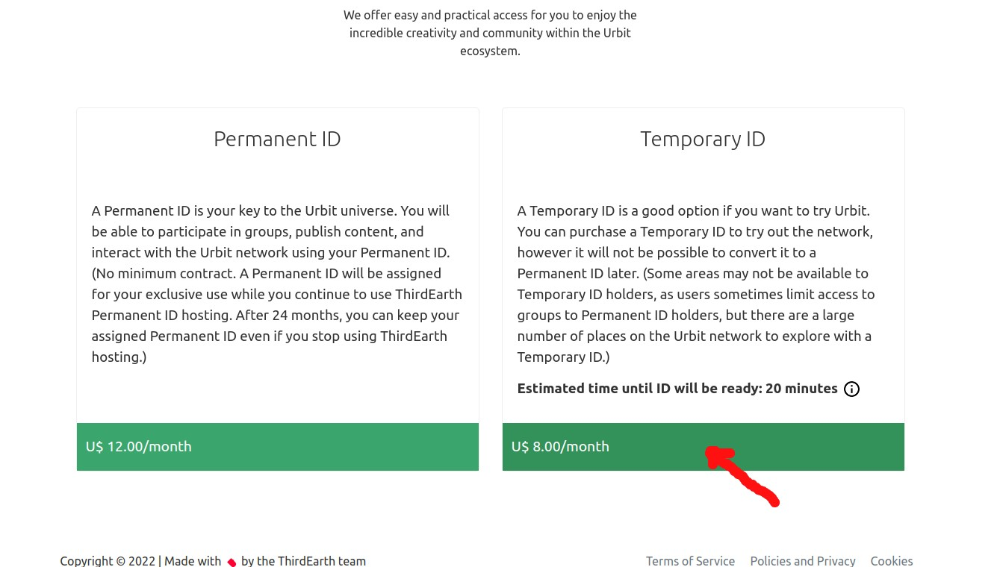
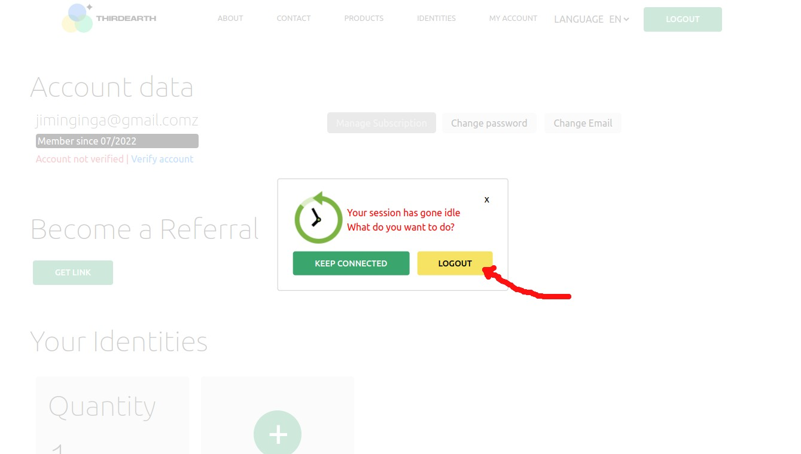
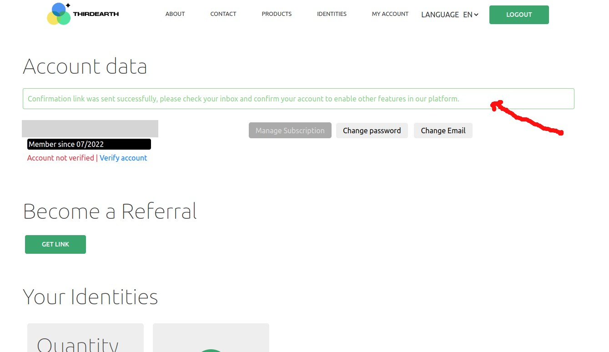
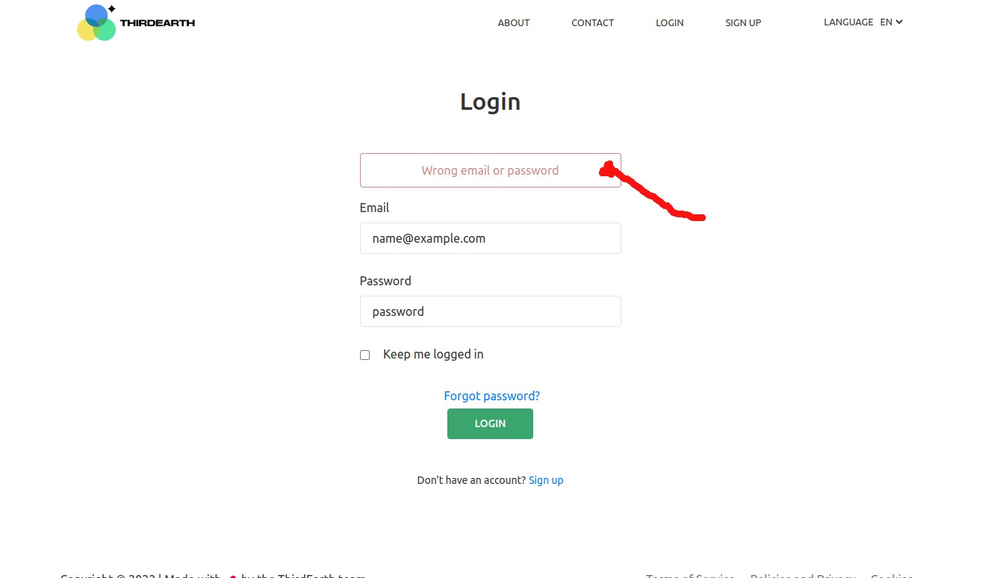

# Colors description

The color section represents the set of colors available to create the site's theme, from primary to tertiary colors, with their respective variations. When customizing your theme, the keys on the objects will indicate which property should be used in the global style sheet. If there is any very specific customization, please contact the ThirdEarth development.

**Tips**

*General background of the site use* 

- ## webSiteBackground color. 

 

Only Banner and navBar( for the navBar, the color is primary when its in '/' path) 

- ### primary color.

  *Announcement container*  
  *ship setting menu*  
  *checkout form button*  
  *secondaryButton (secondary button is the main button using in pages like a home, login, register, contact, logout)*
   use:
   
- ### secondary color

*secondaryButton hover use*
- ### secondaryHover color. 

*Expires Modal*  
*BebackSoon component* 
    use:
- ### tertiary color

 secondary text color is using in every places that background color is not [webSiteBackgroundColor], 
 
*success message* 
use:
- ### success color

*error message* 
use:
- ### error color

*info message* 
use:
- ### info color

*warning message* 
use:
- ### warning color
 
 

# Fonts descriptions 
The font block brings the two possible font groups that the site can use, [primary] being the first option and [secondary] the option that will be loaded if the primary is unavailable
 
 

# Fonts size description
*The block of font size brings a list of sizes for the site's font, where:   **titles h1**(are the main message, like displayed in banner 'Hosting the future starts here')*
 use 
- ### largest size
 
 **h2** *(is used for the majority sub title. Ex: 'What is Urbit?' or 'Why urbit')  use:*
 - ### medium size
 
 **h3** *(are the headers used on cards that describe the details of the urbit. Like what is the urbit id, the os urbit) use*
 - ### small
